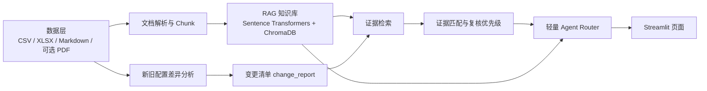

# 流程配置变更 RAG + Agent 助手 Demo

这是一个基于模拟数据的 AI 应用 demo，面向“流程配置变更”场景，展示如何把分散的业务资料转换为可检索知识库，并结合新旧配置差异分析、证据匹配和轻量 Agent Router，辅助业务人员进行变更复核。

当前 demo 支持：

- 多来源资料解析
- RAG 知识库构建
- 新旧配置差异分析
- 变更依据匹配
- 复核优先级建议
- 轻量 Agent Router
- Streamlit 页面展示

## 项目背景

在流程配置更新过程中，系统导出表、部门更新表、任命通知、会议纪要、聊天记录、规则文档等资料往往分散在不同来源。人工核对时容易出现遗漏、依据强弱混淆、聊天记录被误当作正式依据、配置上下文被误判为变更原因等问题。

本项目使用完全虚构的车企/汽车零部件项目开发流程数据，模拟“旧版配置 → 新版目标配置 → 差异识别 → 原始依据检索 → 证据分级 → 人工复核建议”的完整链路。

## 系统架构



## 项目结构

```text
data/                 模拟数据，全部为虚构信息
src/                  核心模块代码
scripts/              命令行脚本入口
outputs/              运行输出目录，向量库缓存不建议提交
docs/                 项目说明和运行手册
app.py                Streamlit Web Demo
requirements.txt      Python 依赖
```

## 核心模块说明

- `src/change_analyzer.py`：对比旧版配置和新版目标配置，生成结构化变更清单。
- `src/document_loader.py`：解析 CSV、XLSX、Markdown 和可选 PDF，将资料切分为统一 chunk。
- `src/rag_engine.py`：使用 `sentence-transformers + ChromaDB` 构建和检索本地知识库，并提供 keyword fallback。
- `src/evidence_matcher.py`：把变更清单中的 `evidence_query` 与原始资料检索结果匹配，输出证据状态和复核优先级。
- `src/agent_router.py`：轻量规则 Router，根据用户问题选择 RAG 检索、差异摘要、证据摘要、复核报告或状态检查。
- `app.py`：Streamlit 页面，整合系统状态、Agent 问答、变更清单、证据匹配、复核报告和 RAG 检索测试。

## 安装环境

推荐使用 Python 3.10+，也可以使用 Python 3.11 或 3.12。

Windows PowerShell：

```powershell
python -m venv .venv
.\.venv\Scripts\Activate.ps1
python -m pip install -r requirements.txt
```

如果 PowerShell 禁止激活脚本，可在当前窗口临时放开执行策略：

```powershell
Set-ExecutionPolicy -Scope Process -ExecutionPolicy Bypass
.\.venv\Scripts\Activate.ps1
```

也可以不激活虚拟环境，直接使用 `.venv` 中的 Python：

```powershell
.\.venv\Scripts\python.exe scripts\run_change_analysis.py
```

## 运行流程

完整流程：

```bash
python scripts/generate_mock_data.py
python scripts/run_change_analysis.py
python scripts/build_knowledge_base.py
python scripts/match_change_evidence.py
python scripts/run_agent.py "聊天记录能不能作为正式变更依据？"
streamlit run app.py
```

如果使用 `.venv` 的 Python：

```powershell
.\.venv\Scripts\python.exe scripts\run_change_analysis.py
.\.venv\Scripts\python.exe scripts\build_knowledge_base.py
.\.venv\Scripts\python.exe scripts\match_change_evidence.py
.\.venv\Scripts\streamlit.exe run app.py
```

说明：

- `scripts/generate_mock_data.py` 会重新生成 `data/` 下的模拟资料。
- `scripts/run_change_analysis.py` 会生成 `outputs/change_report.csv`。
- `scripts/build_knowledge_base.py` 会解析 `data/` 下原始资料并构建本地知识库。
- `scripts/match_change_evidence.py` 会生成 `outputs/change_report_with_evidence.csv` 和 `outputs/evidence_summary.md`。
- `streamlit run app.py` 会启动 Web Demo。

## 示例问题

可以在命令行 Agent 或 Streamlit 页面中尝试：

- 聊天记录能不能作为正式变更依据？
- 旧配置表和新版配置表能不能证明变更原因？
- 新旧配置有哪些变化？
- 哪些变化缺少强变更依据？
- 生成一份本次流程配置变更复核建议报告。
- 新增任务节点需要校验哪些字段？

## RAG 评估

本项目新增轻量 RAG 评估集和评估脚本，用于检查当前知识库的检索效果。评估对象是 retrieval，不评估 LLM 生成质量，也不使用大模型做 judge。

评估集位于：

```text
eval/rag_eval_set.csv
```

评估指标包括：

- `hit@k_by_source_file`：top-k 是否命中期望来源文件。
- `hit@k_by_source_type`：top-k 是否命中期望来源类型。
- `keyword_hit@k`：top-k 文本是否包含期望关键词。
- `evidence_strength_hit@k`：top-k 是否命中期望证据强度。
- `MRR`：按 source_file 或 source_type 首次命中的 rank 计算 reciprocal rank。
- `overall_pass`：命中 source_file，或同时命中 source_type 和关键词，即视为通过。

运行评估前请先构建知识库：

```bash
python scripts/build_knowledge_base.py
python scripts/run_rag_evaluation.py
```

输出文件：

```text
outputs/eval/rag_eval_results.csv
outputs/eval/rag_eval_summary.md
outputs/eval/rag_eval_failed_cases.csv
```

## 当前版本能力

当前版本为 `v0.1`：

- 已完成规则 Router。
- 已完成 RAG 检索。
- 已完成证据匹配。
- 已完成页面展示。
- 已完成轻量 RAG 检索评估。
- 暂未接入大模型 API。
- 暂未做大规模人工标注评估集。

## 后续计划

- 接入大模型 API，用于基于检索结果生成更自然的回答和报告。
- 构建 RAG 评估集，统计 top-k 命中率和证据准确率。
- 支持上传 Excel/PDF。
- 支持飞书 API 或导出表接入。
- 支持增量建库。
- 支持人工复核状态流。

## 免责声明

本项目全部使用虚构模拟数据，不包含任何真实公司、真实客户、真实人员或真实项目信息。项目仅用于技术演示和学习交流，不代表任何真实企业业务流程。
