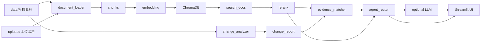

# 流程配置变更 RAG + Agent 助手 Demo

这是一个基于模拟数据的流程配置变更 RAG + Agent 助手 Demo，用于演示如何把分散的流程资料转成可检索知识库，并支持差异分析、证据匹配、复核建议和自然语言问答。

本项目全部使用虚构模拟数据，不包含任何真实公司、真实客户、真实人员或真实项目信息。

## 项目背景

流程配置更新时，信息来源通常分散在多个地方：

- 系统导出表；
- 部门在线更新表；
- 任命调整通知；
- 会议纪要；
- 口头/聊天记录；
- 流程规则文档；
- 上传补充资料。

人工核对时容易遗漏负责人、任务、阶段、交付物、审批角色和变更依据，也容易把配置上下文、规则说明、聊天线索和正式变更依据混在一起。本 demo 用 RAG + 规则 Agent 辅助检索、解释和复核，让变更清单、证据来源和复核优先级更可追踪。

## 当前能力

- 多来源模拟数据生成；
- 新旧配置差异分析；
- 文档解析与 chunk 切分；
- Embedding 向量化；
- ChromaDB 向量库；
- keyword fallback；
- RAG 检索测试；
- 轻量 rerank；
- retrieval_mode 标注；
- strict-vector 检查；
- 证据匹配；
- 复核优先级；
- Agent Router；
- 可选 DeepSeek / OpenAI-compatible LLM API；
- Streamlit 页面；
- 文件上传进入知识库。

## 系统架构



## 项目结构

```text
data/                 虚构模拟数据
uploads/              用户上传资料，真实上传文件不提交 GitHub
eval/                 RAG 评估集
src/                  核心模块
scripts/              命令行脚本
outputs/              运行输出和本地缓存
docs/                 项目文档
app.py                Streamlit Web Demo
requirements.txt      Python 依赖
```

核心模块：

- `src/change_analyzer.py`：新旧配置差异分析；
- `src/document_loader.py`：多格式资料解析和 chunk 切分；
- `src/rag_engine.py`：sentence-transformers + ChromaDB 检索，以及 keyword fallback；
- `src/reranker.py`：轻量规则 rerank；
- `src/evidence_matcher.py`：证据匹配、证据状态和复核优先级；
- `src/agent_router.py`：轻量 Agent Router；
- `src/llm_client.py`：可选 OpenAI-compatible LLM 生成层；
- `src/upload_manager.py`：上传文件保存、manifest 和配置表字段校验；
- `app.py`：Streamlit 页面。

## 完整运行流程

1. Step1 生成模拟数据；
2. Step2 差异分析；
3. Step3 构建知识库；
4. Step4 检索测试；
5. Step5 证据匹配；
6. Step6 Agent Router；
7. Step7 Streamlit 页面；
8. Step8 RAG 评估；
9. Step9 LLM API 可选接入；
10. Step10 rerank；
11. Step11 retrieval_mode 检查；
12. Step12 文件上传。

## 推荐命令

Windows PowerShell：

```powershell
python -m venv .venv
.\.venv\Scripts\Activate.ps1
python -m pip install -r requirements.txt
```

如果 PowerShell 禁止激活脚本：

```powershell
Set-ExecutionPolicy -Scope Process -ExecutionPolicy Bypass
.\.venv\Scripts\Activate.ps1
```

推荐 pipeline：

```powershell
python scripts/generate_mock_data.py
python scripts/run_change_analysis.py
python scripts/build_knowledge_base.py
python scripts/check_rag_mode.py
python scripts/match_change_evidence.py
python scripts/run_rag_evaluation.py --strict-vector
python scripts/run_rag_evaluation.py --rerank --strict-vector
python scripts/run_agent.py "聊天记录能不能作为正式变更依据？"
streamlit run app.py
```

不激活虚拟环境时，也可以直接使用 venv 内的 Python：

```powershell
.\.venv\Scripts\python.exe scripts\run_agent.py "聊天记录能不能作为正式变更依据？"
.\.venv\Scripts\streamlit.exe run app.py
```

## RAG 评估说明

本项目当前评估 retrieval，不评估 LLM 生成。

```powershell
python scripts/check_rag_mode.py
python scripts/run_rag_evaluation.py --strict-vector
python scripts/run_rag_evaluation.py --rerank --strict-vector
```

说明：

- baseline 和 rerank 分开评估、分开输出；
- 必须在同一 `retrieval_mode` 下比较；
- vector mode 下，轻量 rerank 主要提升 top3/top5，top1 只有小幅提升；
- rerank 只能重排序已召回候选，不能解决正确文档未召回的问题；
- 后续可做 query rewrite、hybrid search、模型 reranker、chunk 优化和 metadata 过滤。

输出位置：

```text
outputs/eval/rag_eval_summary.md
outputs/eval/rag_eval_results.csv
outputs/eval/rag_eval_failed_cases.csv
outputs/eval/rag_eval_summary_rerank.md
outputs/eval/rag_eval_results_rerank.csv
outputs/eval/rag_eval_failed_cases_rerank.csv
```

## 文件上传说明

Streamlit 页面提供“文件上传”入口。

支持格式：

- `.csv`
- `.xlsx`
- `.md`
- `.txt`
- `.pdf`

边界：

- PDF 仅支持文本型 PDF；
- 当前版本不支持扫描 PDF OCR；
- 上传文件保存到 `uploads/`；
- 上传后需要重新构建知识库，才会进入 RAG 检索；
- 当前版本上传的 `old_config` / `target_config` 只进入知识库，不自动替换 `data/` 中的主配置表；
- 上传配置表会做基础字段校验，但不会自动参与新旧配置差异分析；
- 真实上传文件、`uploads/upload_manifest.csv` 不提交 GitHub。

## LLM API 说明

默认可不启用 LLM。未配置 `.env`、`LLM_ENABLE=false` 或未检测到有效 API key 时，系统使用规则模板回答。

启用 DeepSeek / OpenAI-compatible API：

```powershell
Copy-Item .env.example .env
```

编辑 `.env`：

```text
LLM_ENABLE=true
LLM_API_KEY=your_real_api_key
LLM_BASE_URL=https://api.deepseek.com
LLM_MODEL=deepseek-v4-flash
```

注意：

- `.env` 不提交；
- `.env.example` 可以提交；
- LLM 只用于回答生成和报告润色；
- LLM 不替代差异分析、证据匹配、证据强弱判断和复核优先级规则；
- 切换到其他 OpenAI-compatible 服务时，通常只需要修改 `LLM_BASE_URL` 和 `LLM_MODEL`。

## 示例问题

- 聊天记录能不能作为正式变更依据？
- 旧配置表和新版配置表能不能证明变更原因？
- 新旧配置有哪些变化？
- 哪些变化缺少强变更依据？
- 生成一份本次流程配置变更复核建议报告。
- SOP 阶段有哪些复核要求？
- 新增任务节点需要校验哪些字段？
- 请检索 A样阶段新增电控测试复核节点 的相关依据

## 当前限制

- 模拟数据规模较小；
- 上传文件暂不自动参与差异分析；
- 暂不支持飞书 API；
- 暂不支持增量建库；
- 暂不支持扫描 PDF OCR；
- 暂未做 LLM 生成质量评估；
- Agent Router 是轻量规则路由，不是 LangGraph 状态机；
- 轻量 rerank 不能解决候选召回不足的问题；
- Streamlit 页面是演示入口，不包含复杂权限系统。

## 后续计划

- 上传配置表参与差异分析；
- 飞书 API 或导出表接入；
- 增量建库；
- query rewrite；
- hybrid search；
- 模型 reranker；
- LLM 生成质量评估；
- 人工复核状态流；
- LangGraph 状态编排；
- 权限与多部门协作。

## 免责声明

本项目全部使用虚构模拟数据，不包含任何真实公司、真实客户、真实人员或真实项目信息。项目仅用于技术演示和学习交流。
