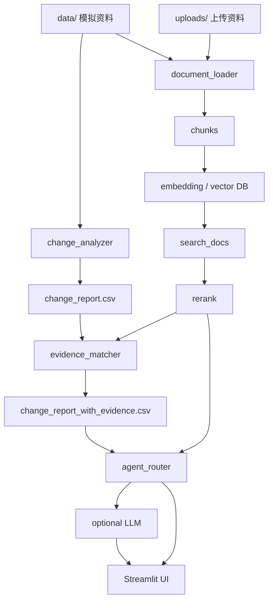

# 项目概览

## 项目目标

本项目是一个“流程配置变更 RAG + Agent 助手 Demo”。它使用完全虚构的车企/汽车零部件项目开发流程资料，演示如何把分散的流程配置资料解析成可检索知识库，并结合新旧配置差异分析、证据匹配、复核优先级、轻量 Agent Router、可选 LLM 生成层和 Streamlit 页面，形成一条可展示的业务应用链路。

项目重点不是替代业务人员做最终判断，而是帮助业务人员更快找到依据、看清证据强弱、识别需要补证和人工复核的变更。

## 系统流程

## 模块输入输出

| 模块 | 输入 | 输出 | 说明 |
| --- | --- | --- | --- |
| `generate_mock_data.py` | 无 | `data/` 模拟文件 | 生成虚构业务资料 |
| `change_analyzer.py` | 旧配置 CSV、新配置 CSV | `outputs/change_report.csv` | 识别新增、删除、字段变更 |
| `document_loader.py` | `data/`、`uploads/` | chunks | 支持 CSV/XLSX/MD/TXT/文本型 PDF |
| `rag_engine.py` | chunks、query | 检索结果 | vector mode 优先，失败后 keyword fallback |
| `reranker.py` | query、候选结果 | 重排序结果 | 轻量规则 rerank，不依赖大模型 |
| `evidence_matcher.py` | change_report、RAG 检索结果 | `change_report_with_evidence.csv` | 判断证据状态、冲突、复核优先级 |
| `agent_router.py` | 用户自然语言问题 | intent、answer、sources | 路由到检索、摘要、报告、状态等工具 |
| `llm_client.py` | 检索结果或结构化统计 | 自然语言回答 | 可选启用，不替代规则判断 |
| `upload_manager.py` | 上传文件 | `uploads/`、manifest | 保存上传资料并做基础校验 |
| `app.py` | 已有模块 | Web Demo | 展示状态、问答、报告、上传和检索 |

## 核心设计

- `outputs/change_report.csv` 是系统分析结果，不作为原始证据进入知识库。
- 旧配置表和新版配置表属于配置上下文，只能说明“旧版/新版是什么”，不能单独证明“为什么变更”。
- 任命调整通知和正式会议纪要属于强变更依据。
- 部门在线更新表属于中等变更依据，通常还需要正式通知或会议纪要确认。
- 聊天记录和口头通知只能作为弱线索，不能直接作为正式变更依据。
- 规则文档说明复核规则，但不能证明某条具体变更已经发生。
- LLM 只用于表达、总结和润色，不修改 evidence_status、review_priority 等结构化判断。

## 当前模块亮点

- 多源资料模拟：同时覆盖结构化表格、Markdown 文档、聊天记录和规则文档。
- 可解释证据链：每条变更可追溯到检索到的来源文件、source_type 和 evidence_strength。
- retrieval_mode 可观测：评估结果记录 `vector` 或 `keyword_fallback`，避免误读指标。
- rerank 前后对比：baseline 与 rerank 分开评估，便于观察排序优化效果。
- 上传资料进入知识库：上传补充资料后重建知识库，即可被 RAG 和 Agent 检索。
- LLM 不越权判断：大模型只做生成层，业务判断仍由规则和证据链控制。

## 文件上传能力边界

上传文件仅作为补充知识库资料，不会自动替换 `data/` 中的旧版/新版主配置表，也不会自动触发新旧配置差异分析。

上传 `old_config` / `target_config` 时会做基础字段校验：

- 必须字段：`business_domain`、`phase`、`task_name`
- 推荐字段：`owner_name`、`responsible_department`、`deliverable`、`approval_role`

即使字段满足要求，当前版本也只将该文件纳入知识库检索。后续可扩展为“上传配置表参与差异分析”的正式流程。

## 当前限制

- 模拟数据规模较小，不能代表真实企业全量复杂流程；
- 暂不支持飞书 API；
- 暂不支持扫描 PDF OCR；
- 暂不支持增量建库；
- Rerank 是轻量规则版本，不能解决召回不足；
- Agent Router 是规则路由，不是完整状态机；
- Streamlit 页面是演示入口，不包含权限系统和多人协同流程；
- 暂未对 LLM 生成质量做独立评估。
